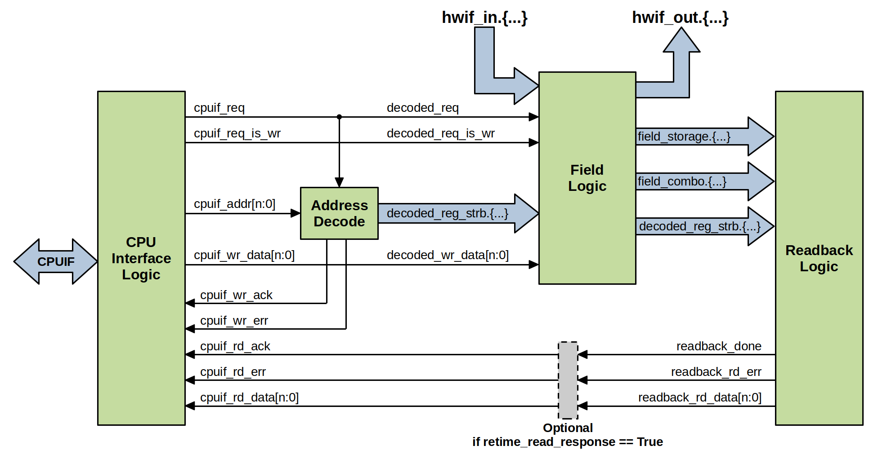
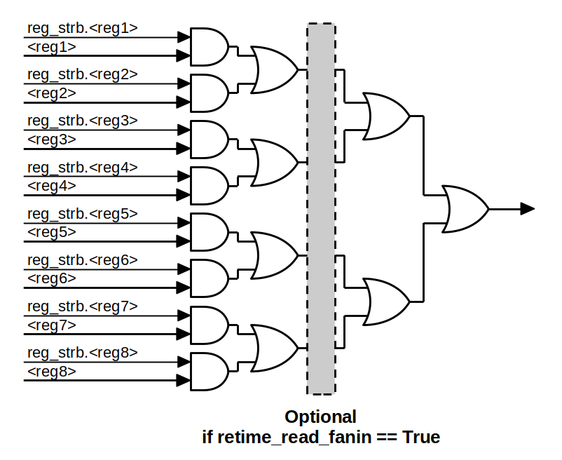

Register Block Architecture
===========================

The generated register block RTL is organized into several sections.
Each section is automatically generated based on the source register model and
is rendered into the output register block SystemVerilog RTL.

Although it is not completely necessary to know the inner workings of the
generated RTL, it can be helpful to understand the implications of various
exporter configuration options.

CPU Interface
-------------
The CPU interface logic layer provides an abstraction between the
application-specific bus protocol and the internal register file logic.
This logic layer normalizes external CPU read & write transactions into a common
:ref:`cpuif_protocol` that is used to interact with the register file.

Address Decode
--------------
A common address decode operation is generated which computes individual access
strobes for each software-accessible register in the design.
This operation is performed completely combinationally.

Field Logic
-----------
This layer of the register block implements the storage elements and state-change
logic for every field in the design. Field state is updated based on address
decode strobes from software read/write actions, as well as events from the
hardware interface input struct.
This section also assigns any hardware interface outputs.

Readback
--------
The readback layer aggregates and reduces all readable registers into a single
read response. During a read operation, the same address decode strobes are used
to select the active register that is being accessed.
This allows for a simple OR-reduction operation to be used to compute the read
data response.

For designs with a large number of software-readable registers, an optional
fanin re-timing stage can be enabled. This stage is automatically inserted at a
balanced point in the read-data reduction so that fanin and logic-levels are
optimally reduced.

A second optional read response retiming register can be enabled in-line with the
path back to the CPU interface layer. This can be useful if the CPU interface protocol
used has a fully combinational response path, and the design's complexity requires
this path to be retimed further.
