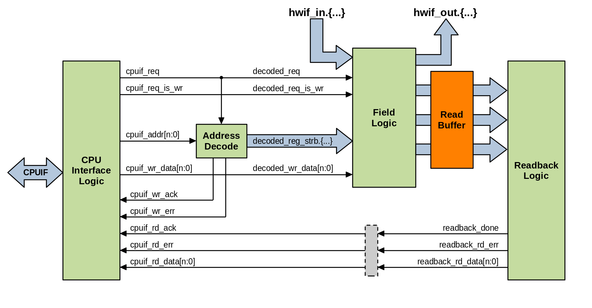

.. _read_buffering:

Read-buffered Registers
=======================

Read buffering is a mechanism that allows for software accesses to read a
snapshot of one or more registers atomically. When enabled on a register, a
read buffer will latch the state of its fields when triggered such that software
can read a coherent snapshot of one or more registers' value.

Some examples of when this is useful:
    *   A wide 64-bit status register needs to be read atomically, but the CPU
        interface is only 32-bits.
    *   Software needs to be able to read the state of multiple registers
        atomically.
    *   A hardware event latches the software-visible state of one or more
        registers.

Properties
----------
The behavior of read-buffered registers is defined using the following two
properties:

.. literalinclude:: ../../hdl-src/regblock_udps.rdl
    :lines: 10-18

These UDP definitions, along with others supported by PeakRDL-regblock can be
enabled by compiling the following file along with your design:
:download:`regblock_udps.rdl <../../hdl-src/regblock_udps.rdl>`.

.. describe:: buffer_reads

    *   Assigned value is a boolean.
    *   If true, enables double-buffering of software reads of this register.
    *   The read buffer will load the register's field values when its trigger
        event is asserted.
    *   Unless specified otherwise, the buffer trigger occurs when the lowest
        address of the buffered register is read.
    *   When read by software the data returned is from the buffer contents, not
        directly from the register's fields.

.. describe:: rbuffer_trigger

    *   Assigned value is a reference to a register, single-bit field, signal, or
        single-bit property.
    *   Controls when the double-buffer loads the register's field vaues into the
        buffer storage element.
    *   If reference is a single-bit value (signal, field, property reference),
        then the assertion of that value triggers the buffer to be evicted.
    *   Signal references shall have either activehigh/activelow property set to
        define the polarity.
    *   If the reference is a reg, then buffer is loaded when the register's
        lowest address is read.

Other Rules
^^^^^^^^^^^
*   It is an error to set ``buffer_reads`` if the register does not contain any
    readable fields
*   If ``buffer_reads`` is false, then anything assigned to ``rbuffer_trigger``
    is ignored.
*   The buffered register and the trigger reference shall both be within the same
    internal device. ie: one cannot be in an external scope with respect to the
    other.
*   Unless it is a register, the reference assigned to ``rbuffer_trigger`` shall
    represent a single bit.
*   The software read operation considered to take place when the buffer is loaded.
    This influences the behavior of properties like ``swmod`` and ``swacc`` -
    they are not asserted until the register's fields are actually sampled by the
    buffer.
*   If a read-buffered register is wide (accesswidth < regwidth) and is its own
    trigger, the first sub-word's buffer is bypassed to ensure the first read
    operation is atomically coherent with the rest of the sampled register.

Examples
--------
Below are several examples of what you can do with registers that are
read-buffered.

Wide Atomic Register
^^^^^^^^^^^^^^^^^^^^
In this example, a wide 64-bit read-clear counter is implemented.
Without read-buffering, it is impossible to coherently read the state of the
counter using a 32-bit CPU interface without risking a discontinuity. With
read-buffering enabled, the read of the lower half of the register will trigger
the upper half's value to be latched. A subsequent software access can then
coherently read the rest of the register's buffered value.

.. code-block:: systemrdl
    :emphasize-lines: 4

    reg {
        regwidth = 64;
        accesswidth = 32;
        buffer_reads = true;
        field {
            sw=r; hw=na;
            counter;
            incr;
        } my_counter[63:0] = 0;
    };

Atomic Group of Registers
^^^^^^^^^^^^^^^^^^^^^^^^^
Perhaps you have a group of registers that monitor some rapidly-changing state
within your design. Using the ``rbuffer_trigger`` property, you can define which
register read operation triggers the buffered registers' values to be latched.

.. code-block:: systemrdl
    :emphasize-lines: 11-14

    reg my_status_reg {
        field {
            sw=r; hw=w;
        } value[31:0];
    };

    my_status_reg status1;
    my_status_reg status2;
    my_status_reg status3;

    status2->buffer_reads = true;
    status2->rbuffer_trigger = status1;
    status3->buffer_reads = true;
    status3->rbuffer_trigger = status1;

In this example, when software reads status1, this triggers status2-status3
registers to latch their values into their respective read buffers. Subsequent
reads to status2 and status3 return the value that these registers contained at
the moment that status1 was read. This makes it possible for software to read
the state of multiple registers atomically.

Externally Triggered Register Sampling
^^^^^^^^^^^^^^^^^^^^^^^^^^^^^^^^^^^^^^
If needed, an external trigger can be used to load a read buffer.
This can be useful if precise timing of software's view of the register state is
required.

.. code-block:: systemrdl
    :emphasize-lines: 14-15

    reg my_status_reg {
        buffer_reads = true;
        field {
            sw=r; hw=w;
        } value[31:0];
    };

    my_status_reg status1;
    my_status_reg status2;

    signal {
        activehigh;
    } trigger_signal;
    status1->rbuffer_trigger = trigger_signal;
    status2->rbuffer_trigger = trigger_signal;

When ``hwif_in..trigger_signal`` is asserted, the state of registers ``status1``
and ``status2`` is buffered.
