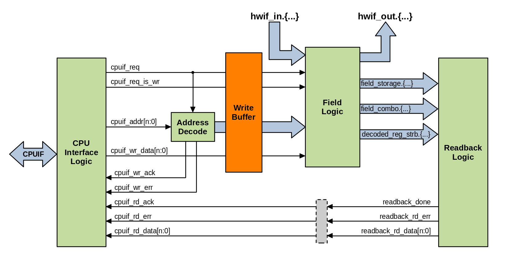

.. _write_buffering:

Write-buffered Registers
========================

In order to support larger software write accesses that are atomic, the
regblock generator understands several UDPs that implement write-buffering to
specific registers. This causes the regblock to delay the effect of a software
write operation until a defined trigger event.

Some examples of when this is useful:
    *   You need to have software update a wide 64-bit register atomically, but
        the CPU interface is only 32-bits.
    *   Software needs to be able to write multiple registers such that the
        hardware is updated atomically.
    *   Software can pre-load one or more registers with their next value, and
        trigger the update via an external hardware signal.

If a register is write-buffered, a holding buffer stage is inserted between the
decode logic and the field logic. This effectively defers any software write
operations to that register until a trigger event occurs that releases it.
Write buffering storage is unique to each register that enables it.
If a register is not write buffered, this buffer stage is bypassed.

Properties
----------
The behavior of write-buffered registers is defined using the following two
properties:

.. literalinclude:: ../../hdl-src/regblock_udps.rdl
    :lines: 20-28

These UDP definitions, along with others supported by PeakRDL-regblock can be
enabled by compiling the following file along with your design:
:download:`regblock_udps.rdl <../../hdl-src/regblock_udps.rdl>`.

.. describe:: buffer_writes

    *   Assigned value is a boolean.
    *   If true, enables double-buffering of writes to this register.
    *   Any software write operation to a buffered register is held back in a
        storage element unique to the register.
    *   The software write operation is committed to the register once triggered
        to do so.
    *   Unless specified otherwise, the buffer trigger occurs when the highest
        address of the buffered register is written.

.. describe:: wbuffer_trigger

    *   Assigned value is a reference to a register, single-bit field, signal,
        or single-bit property.
    *   Controls when the double-buffer commits the software write operation to
        the register's fields.
    *   If reference is a single-bit value (signal, field, property reference),
        then the assertion of that value triggers the buffer to be evicted.
    *   Signal references shall have either activehigh/activelow property set to
        define the polarity.
    *   If the reference is a reg, then buffer is evicted when the register's
        highest address is written.

Other Rules
^^^^^^^^^^^
*   It is an error to set ``buffer_writes`` if the register does not contain any
    writable fields
*   If ``buffer_writes`` is false, then anything assigned to ``wbuffer_trigger``
    is ignored.
*   The buffered register and the trigger reference shall both be within the
    same internal device. ie: one cannot be in an external scope with respect to
    the other.
*   Unless it is a register, the reference assigned to ``wbuffer_trigger`` shall
    represent a single bit.
*   If a buffered register was not written, any trigger events are ignored.
*   It is valid for a buffered register to be partially written (either via
    write strobes, or partial addressing).
*   The software write operation is not considered to take place until the
    buffer is evicted by the trigger. This influences the behavior of properties
    like ``swmod`` and ``swacc`` - they are not asserted until the register's
    fields are actually written by the buffer.

Examples
--------
Below are several examples of what you can do with registers that are
write-buffered.

Wide Atomic Register
^^^^^^^^^^^^^^^^^^^^
Without write-buffering, it is impossible to update the state of a 64-bit
register using a 32-bit CPU interface in a single clock-cycle.
In this example, it still requires two write-cycles to update the register, but
the register's storage element is not updated until both sub-words are written.
Upon writing the 2nd sub-word (the higher byte address), the write data for both
write cycles are committed to the register's storage element together on the
same clock cycle. The register is updated atomically.

.. code-block:: systemrdl
    :emphasize-lines: 4

    reg {
        regwidth = 64;
        accesswidth = 32;
        buffer_writes = true;
        field {
            sw=rw; hw=r;
        } my_field[63:0] = 0;
    };

Atomic Group of Registers
^^^^^^^^^^^^^^^^^^^^^^^^^
Perhaps you have a group of registers that need their state to be updated
atomically. Using the ``wbuffer_trigger`` property, you can define which
register write operation triggers the group to be updated.

.. code-block:: systemrdl
    :emphasize-lines: 2, 18-20

    reg my_buffered_reg {
        buffer_writes = true;
        field {
            sw=rw; hw=r;
        } my_field[31:0] = 0;
    };

    my_buffered_reg reg1;
    my_buffered_reg reg2;
    my_buffered_reg reg3;

    reg {
        field {
            sw=rw; hw=r;
        } my_field[31:0] = 0;
    } reg4;

    reg1->wbuffer_trigger = reg4;
    reg2->wbuffer_trigger = reg4;
    reg3->wbuffer_trigger = reg4;

In this example software may pre-write information into reg1-reg3, but the
register write operations do not take effect until software also writes to reg4.
The write operation to reg4 triggers the buffered data to be committed to
reg1-reg3. This is guaranteed to occur on the same clock-cycle.

Externally Triggered Register Update
^^^^^^^^^^^^^^^^^^^^^^^^^^^^^^^^^^^^
Some applications may require precise timing for when a register (or group of
registers) update their value. Often software cannot offer such timing
precision.

In this example, the trigger event is bound to an external signal. When
asserted, any pending write operation the buffered register will be committed.
The hwif_out value presents the new register state on the clock cycle after the
trigger is asserted.

.. code-block:: systemrdl
    :emphasize-lines: 2, 11-13

    reg my_buffered_reg {
        buffer_writes = true;
        field {
            sw=rw; hw=r;
        } my_field[31:0] = 0;
    };

    my_buffered_reg reg1;
    my_buffered_reg reg2;

    signal {
        activehigh;
    } trigger_signal;
    reg1->wbuffer_trigger = trigger_signal;
    reg2->wbuffer_trigger = trigger_signal;

After software writes to ``reg1`` & ``reg2``, the written data is held back in
the write buffer until ``hwif_in..trigger_signal`` is asserted by the hardware.
